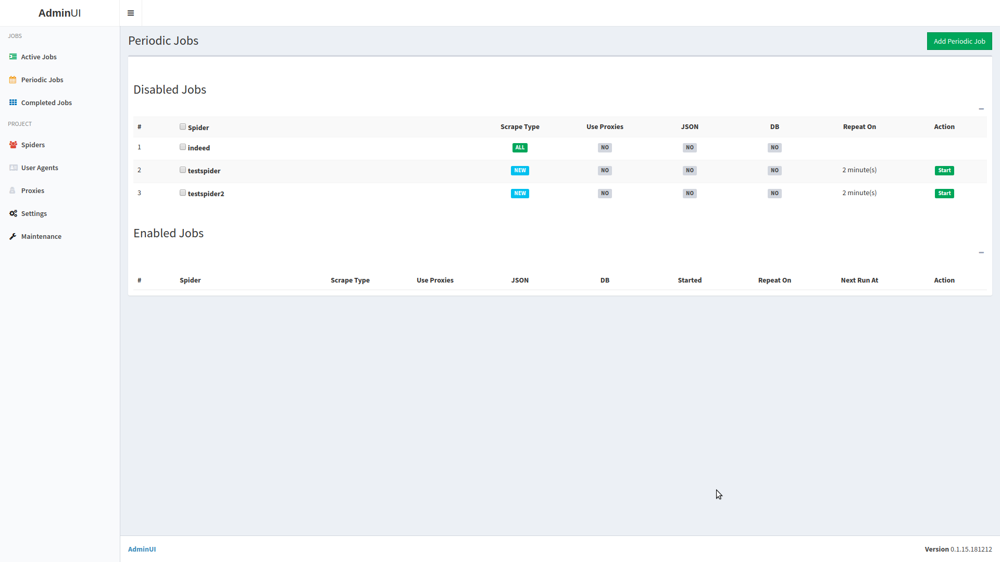

# Job Posts Scraper


### Screenshot




### Requirements

- python (>=3.5)
- RabbitMQ (Celery dependency)
- Redis (WebUI/Spider dependency)
- MySQL (Data storage dependency)


### Project Structure

- jobscraper
-- application (WebUI and Spider source code files)
-- data (WebUI storage directory)
-- docs (project documentation)
-- logs (WebUI, Celery and Spider log files)
-- results (scraped data in JSON format)
-- webui (WebUI static and template files)
-- config.py (default project configuration)
-- main.py (WebUI main entry point)
-- tasks.py (Celery main entry point)


### Installation

First install the external dependencies (RabbitMQ, Redis and MySQL) if they aren't installed. Note: in order to avoid MySQL related unicode errors, pick an appropriate database encoding like UTF8MB4 or similar.
Then install required Python libraries with:
```
pip install -r requirements.txt
```


### Configuration

Administration is done through a web panel. Make sure that appropriate port (default is 4000) is free before running the web panel. You can change the port in PROJECT_DIR/config.py file by changing the WEBUI_PORT constant. Go to the project directory and run WebUI:
```
./run_webui
```

Open http://localhost:4000/ or http://127.0.0.1:4000/ in your web browser. Click the Settings side bar link. Enter your RabbitMQ, Redis and MySQL connection details. Verify connection settings by click the *Test Settings* button.


### Usage

Go to the project directory and run WebUI if it isn't started.
```
./run_webui
```

Run Celery from the separate console session/tab/window:
```
./run_celery
```
Add -d switch in order to run Celery in development mode, piping verbose output only to console/stdout:
```
./run_celery -d
```


#### Scrape job

Go to the *Spiders* section, select at least one spider and click *Run*. You can change scrape settings here (scrape type, results save target and proxy usage) for current job. Setting will be autosaved after each spider run.


#### Periodic Scrape Job

Go to *Periodic jobs* section, select at least one spider and click *Add Periodic Job*. Adjust scrape details and choose pause time between two scrapes. Periodic job for each spider will spawn one regular scrape job after each repeat time/delay end.
Take note: periodic jobs are run in delay->job->delay->job ... order.


#### Scraped Data Storage

##### JSON

Data is saved to a filesystem in "PROJECT_DIR/results/feeds/" as a "SPIDERNAME TIMESTAMP.json" file.

##### MySQL

Data is saved to *job_posts* table. Table structure/model is:

- id = Column(Integer, primary_key=True)
- job_post_id = Column(String(32), unique=True, nullable=False)
- url = Column(String(512), nullable=False)
- title = Column(String(512), nullable=False)
- location = Column(String(256))
- description = Column(Text(), nullable=False)
- date_added = Column(DateTime, nullable=False)
- date_job_posted = Column(DateTime, nullable=False)


##### User Agents

Scraper automatically loads the user agent list from PROJECT_DIR/data/user_agents.txt, and changes user agent for every request. You can change the list of user agents from the *User Agents* section in AdminUI. JobScraper will use one random user agent per spider run. If proxies are used it'll try to bind one random user agent to one proxy IP.


###### Proxies

You can change the proxies from a *Proxies* section.
Each proxy will be disabled/removed after configured number of retries. If there are no valid proxies, spider(s) will stop with scraping.
List of proxies is located in PROJECT_DIR/data/proxies.txt, one proxy per line in format:
```
PROTOCOL://HOST:PORT/
```
Example proxy list:
```
http://127.0.0.1:80/
http://127.0.0.1:8080/
http://127.0.0.1:8888/
```


###### Delays

Sets a time delay between each scrape requests.


###### Concurrent Connections

Sets a number of parallel requests issued by one spider.


###### Retries

Sets a number of scrape attempts on one URL before giving up totally.


###### Timeout

Sets a delay in seconds to wait for response before retrying or finally giving up.


#### Reliability

Sometimes scrapes will fail because of connection issues or because target server is down or overloaded. Lower these values to increase speed and decrease reliability or increase them get less speed but more reliable scraping.


#### Scrape modes

- Scrape all: default scraping mode, spider will try to scrape all job posts for given keywords/countries.
- Scrape new: spider will try to fetch only the most recent ones (from the first page of the results).
